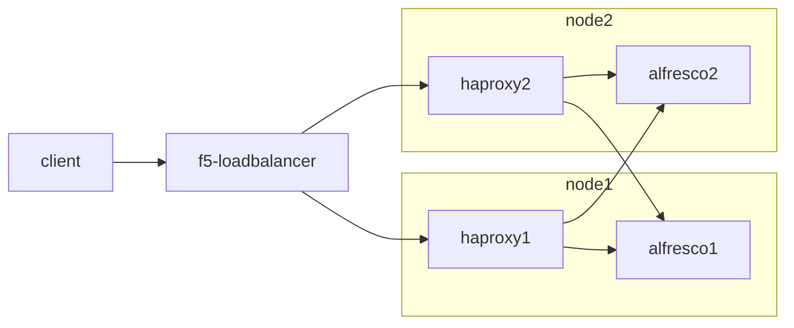
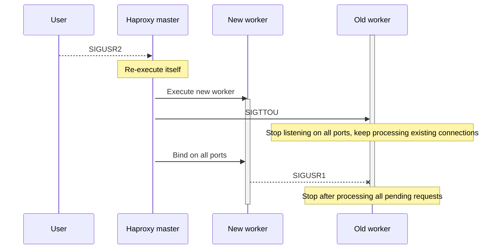

This month's production outage is brought to you by Haproxy and HTTP keep-alive.

# The setup

At a customer, we have a clustered Alfresco setup with docker containers.
This is a high-availability setup with two nodes.
Clients connect through an externally managed F5 loadbalancer, which then connects to one of our Haproxy loadbalancers.

Under normal conditions, Haproxy sends traffic to both Alfresco servers.
The setup with two levels of loadbalancers is made because we want to be able to disable an Alfresco backend during deployments.



Because Alfresco is running in docker containers, they don't have fixed IP addresses that can be put in the Haproxy configuration.
This is one of the reasons why we have a consul cluster running at each client. A helper process will grab the containers IP addresses from consul, then writes the configuration for haproxy and sends a `SIGUSR2` to haproxy, which will cause it to reload its configuration.

# A problem

One fateful night, Alfresco needs to be shut down for a couple of hours for a scheduled database maintenance operation.
After this database maintenance, Alfresco is started up again. A manual sanity check indicates that both Alfresco nodes are back up and running and everything is fine.

However, not everything was fine. In the morning, we receive a phone call that requests to Alfresco are failing with HTTP 503 Service Unavailable. After restarting haproxy, these errors subdue.

# Investigation

As the reader of this blog might already have noticed, I do not like it when things go badly and I don't know what caused the issue. After all, the only way to prevent the same issue from wreaking havoc again is to find the root cause and to eliminate it.

Since we already restarted some services to recover as fast as possible, some amount of evidence is gone now. But thanks to Kibana, we still have a good amount of data to work with after the fact.

## Finding the culprit

We make a graph of the haproxy access logs, where we graph HTTP 503 responses (red) and all other responses (green).

Since only some requests were answered with an error, we try to find out what's wrong exactly by splitting the graphs based on which node the haproxy server runs on, and which backend haproxy is sending to.


These graphs look very strange in two ways:

 1. Traffic appears to be only sent to one Alfresco node.
 2. Traffic of the one haproxy server to one backend is returning a 503 error half of the time.

It is expected that traffic is only sent to one Alfresco node. Haproxy is configured to use sticky loadbalancing based on source IP. Since all traffic comes from the F5 loadbalancer, there is only one source IP, and everything is sent to the same (first) backend server.

However, that half of the requests to one haproxy server and backend are returning a 503 error is quite unexpected. We know that that haproxy server and that Alfresco backend are running on the same server, so network issues can be excluded as a cause.

Things that we already encountered before that return 503 errors are:

 * Haproxy configuration is not updated when the Alfresco container is recreated and changed IP address, resulting in haproxy not being able to reach the Alfresco backend
 * Docker overlay networking is broken, and containers can't reach each other
 * Alfresco healtcheck failed on both nodes, and both nodes were removed from the haproxy configuration

None of these cases explains why some requests are succeeding and others failing, and why the situation recovered after haproxy was restarted.

## Into the failing haproxy container

Looking at the logs of that haproxy server in kibana showed something strange:

```syslog
<134>Dec 20 05:50:56 haproxy[45085]: xxx.xxx.xxx.194:2133 [20/Dec/2019:05:50:56.643] internet-xxx.xxx.xxx.82 alfresco/alfresco-core0 0/0/1/123/129 200 63108 - - --NN 4/4/0/1/0 0/0 "GET /alfresco/ HTTP/1.1"
<134>Dec 20 05:50:56 haproxy[31628]: xxx.xxx.xxx.196:38412 [20/Dec/2019:05:50:49.099] internet-xxx.xxx.xxx.82 alfresco/alfresco-core0 0/5518/-1/-1/7523 503 212 - - SCNN 1/1/1/0/2 0/0 "GET /alfresco/ HTTP/1.1"
```

There are many lines similar to these, where about half of these requests succeed, and the other half fail.

One thing that we notice when looking at the log messages is that failures are consistently logged by `haproxy[31628]` and successful requests are logged by `haproxy[45085]`. Failing requests are also always coming from the same set of IPs and ports.

In normal circumstances, there should only be one haproxy worker process that handles requests, as [nbproc](https://cbonte.github.io/haproxy-dconv/2.0/configuration.html#3.1-nbproc) is set to 1. The fact that 2 worker processes are running at the same time is an indication that something went wrong.

## How haproxy reloads its configuration

Like many *nix daemons, haproxy implements a reload mechanism that allows loading a new configuration without stopping and starting the server.
In haproxy, there are multiple ways the reload mechanism works, depending on the mode in which haproxy is started.
We are using the master-worker mode, so I will only describe that mechanism here.

The reload starts when the master process receives a `SIGUSR2` signal.


